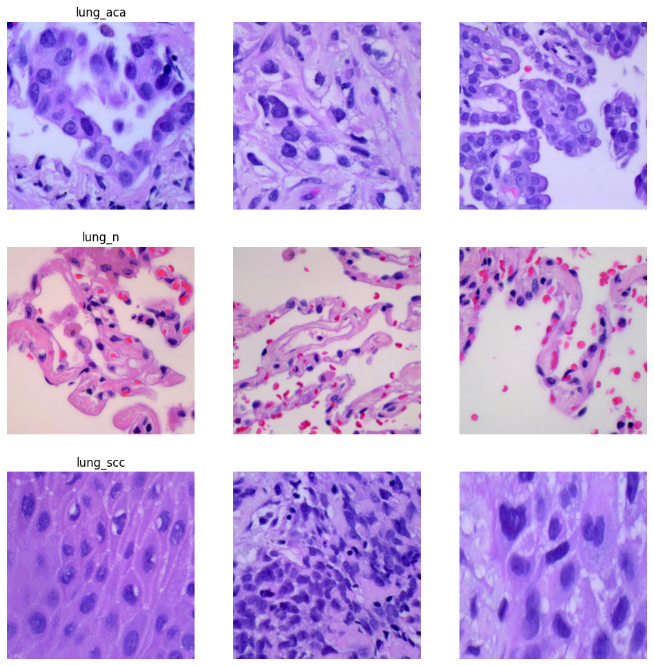
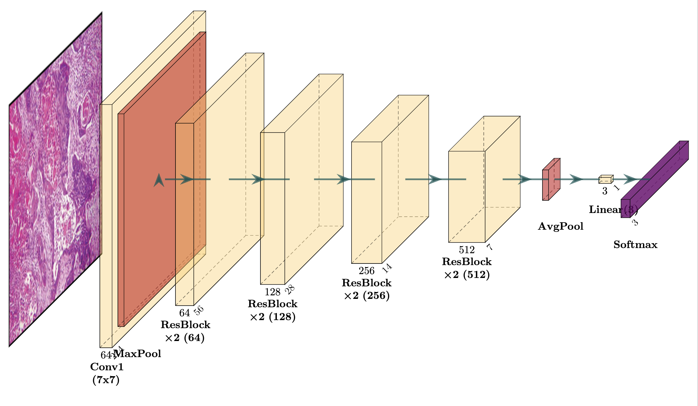
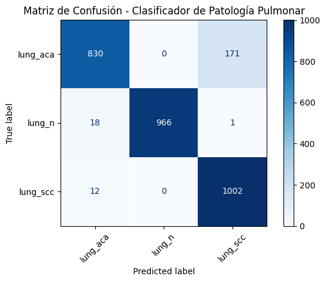

# 🧠 LungCancer-ResNetClassifier

This repository contains the complete implementation of a deep learning pipeline for histopathological image classification of lung cancer using a custom-built ResNet-18 architecture, named `ResNetLung`. The goal is to classify H&E-stained microscopy images into three categories: 

- **lung_aca** (adenocarcinoma)  
- **lung_scc** (squamous cell carcinoma)  
- **lung_n** (normal lung tissue)

---

## 📁 Dataset

We use the publicly available [LC25000 dataset](https://www.kaggle.com/datasets/andrewmvd/lung-and-colon-cancer-histopathological-images), filtered to include only lung-related classes. Each class contains 5,000 high-resolution histopathological images.

<p align="center">
  
</p>


---

## 🏗️ Model Architecture

The `ResNetLung` model is inspired by the original ResNet-18 but implemented from scratch using PyTorch. It includes:

- Initial 7×7 Conv + MaxPool  
- 4 residual blocks with [2,2,2,2] units  
- AdaptiveAvgPool2D  
- Final `Linear(512 → 3)` output layer  

The model was trained for **10 epochs**, achieving **95.61% validation accuracy**.

<p align="center">
  
</p>

---

## 🔍 Evaluation

The classifier achieves strong performance across all classes. Below is the confusion matrix from the final evaluation:

<p align="center">
  
</p>

---

## 📦 Pretrained Models

Two versions are available for direct use:

| File | Description |
|------|-------------|
| `resnet_lung_model.pt` | Full model (architecture + weights) |
| `resnet_lung_weights.pth` | Only trained weights (for loading into same architecture) |

To load and use them:
```python
# Load full model
model = torch.load('resnet_lung_model.pt')
model.eval()

# Or load weights into same architecture
model = ResNetLung(ResidualBlock, [2, 2, 2, 2], num_classes=3)
model.load_state_dict(torch.load('resnet_lung_weights.pth'))
model.eval()